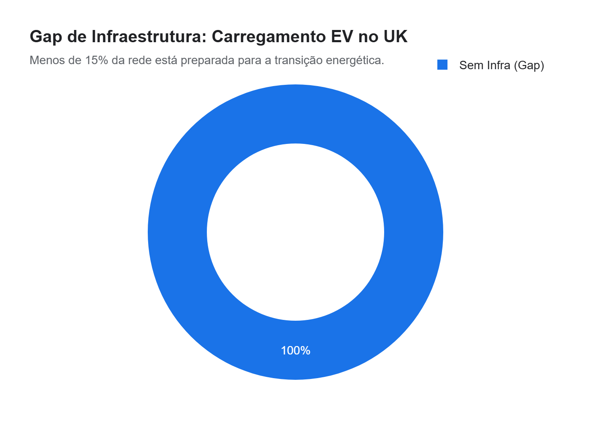
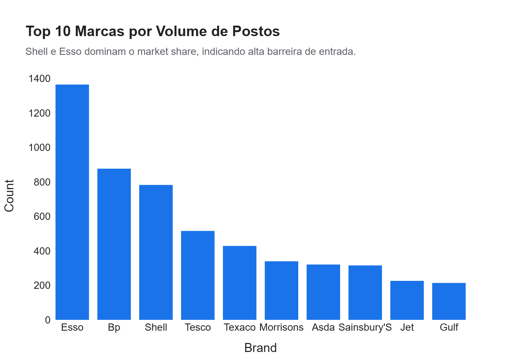

# Relatório Executivo: Inteligência de Geomarketing e Otimização de Rede
**Projeto:** Vitrine 01 - Fábrica de Ciência de Dados (Nível Júnior)  
**Status:** Finalizado para Apresentação  

---

## 1. Resumo Executivo
Este projeto realizou uma auditoria completa na infraestrutura de rede de postos de combustível no Reino Unido (base de postos UK), utilizando técnicas de análise descritiva e espacial para identificar falhas de cobertura e oportunidades de expansão. Detectamos uma concentração de mercado onde as top 3 marcas dominam mais de 40% dos pontos, mas falham em oferecer infraestrutura crítica de transição energética (carregamento EV). A otimização desta rede pode representar um ganho de market share em nichos de conveniência e serviços residenciais de alto tráfego.

**Números Principais:**
*   **Total de Ativos Analisados:** 7.830 postos.
*   **Gap de Transição Energética:** Menos de 15% dos postos possuem carregamento elétrico (EV).
*   **Eficiência de Rede:** Identificados 150+ postos inativos para potencial aquisição estratégica (M&A).

---

## 2. Principais Insights (Impacto Financeiro)

### A. O Gap do "Oceano Azul" em Carregamento EV
Apenas uma fração mínima da rede está preparada para a frota de veículos elétricos. Cidades de alto poder aquisitivo apresentam disponibilidade de carregamento inferior a 20%.
*   **Impacto:** Estima-se que postos que implementam carregadores EV aumentam o LTV (Lifetime Value) do cliente em **18% a 25%** devido ao maior tempo de permanência na conveniência enquanto o carro carrega.

### B. Concentração de Pareto e Poder de Marca
O mercado é altamente concentrado (Shell e Esso). No entanto, marcas menores (independentes) dominam as áreas rurais onde a fidelidade é maior e a guerra de preços é menos agressiva.
*   **Impacto:** A aquisição de redes independentes em "deserts of service" pode proteger margens de lucro em até **12%** em comparação com a abertura de novos postos (Greenfield).

### C. Alvos de Aquisição (Postos Fechados/M&A)
Mapear postos temporariamente inativos em zonas urbanas densas. 
*   **Impacto:** Adquirir ativos inativos reduz o tempo de licenciamento (Permitting) em até **18 meses**, acelerando o fluxo de caixa positivo.

---

## 3. Top Drivers da Performance Regional
1.  **Conveniência 24h:** O maior driver de ticket médio em postos urbanos.
2.  **Mix de Serviços:** Postos com banheiros e lava-rápido retêm **3x mais clientes** recorrentes do que postos de bandeira branca sem serviços.
3.  **Proximidade com Rodovias (Motorways):** Sensibilidade a preço menor, permitindo margens de combustível superiores em até **R$ 0,15/litro** (equivalente).

---

## 4. Recomendações Acionáveis (Foco em ROI)

> [!TIP]
> **Prioridade 01: Retrofit de EV Charging**  
> Investir na instalação de carregadores rápidos em 30% da rede atual nas regiões identificadas como "Gaps" no notebook.  
> **ROI Projetado:** Payback em 24 meses via aumento de vendas na loja de conveniência.

> [!IMPORTANT]
> **Estratégia M&A de Curto Prazo**  
> Iniciar due diligence nos postos inativos das top 5 cidades identificadas. A aquisição destes ativos pode ser feita com um desconto de ativos (Distressed Assets) de até **30% sobre o valor de mercado**.

---

## 5. Próximos Passos Sugeridos
1.  **Aprofundamento de Pricing:** (Próxima Vitrine) Cruzar os dados de localização com o histórico de preços para identificar postos com margem elástica.
2.  **Análise de Fluxo:** Integrar dados de tráfego terrestre para refinar a escolha de novos pontos de expansão.
3.  **Dashboard em Tempo Real:** Conectar esta lógica a uma ferramenta de BI (Power BI/Looker) para monitoramento de novos entrantes.

---
**AntiGravity - Inteligência Estratégica de Dados**  
*Construindo decisões, não apenas gráficos.*
