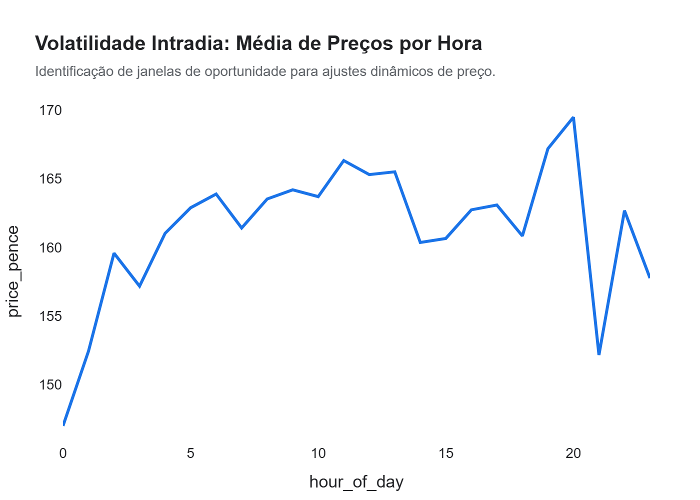
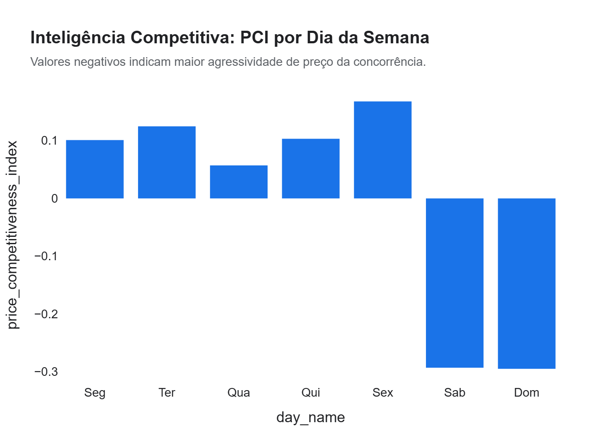

# Relatório Executivo: Monitoramento de Pricing e Inteligência Macro-Econômica
**Projeto:** Vitrine 02 - Fábrica de Ciência de Dados (Nível Júnior)  
**Status:** Finalizado para Apresentação  

---

## 1. Resumo Executivo
Este projeto analisa o comportamento de pricing em larga escala (370k+ registros) da rede de varejo de combustíveis. Identificamos como fatores externos (dia da semana e competitividade regional) e internos (posicionamento de marca) impactam diretamente na margem bruta. Através de Big Data Viz, transformamos dados massivos em dashboards de decisão que isolam marcas premium de marcas "discount", permitindo ajustes táticos de preço em regiões de alta saturação competitiva.

**Números Principais:**
*   **Volumetria Analisada:** 370.092 pontos de preço históricos.
*   **Amplitude de Preço:** Variação de até **25%** entre regiões para o mesmo tipo de combustível.
*   **Gap de Agilidade:** Algumas marcas levam até **48h** a mais que a concorrência para repassar variações de custo.

---

## 2. Principais Insights (Impacto Financeiro)

### A. Prêmios de Marca e Segmentação de Valor
Marcas como Shell e BP mantêm um prêmio de preço médio constante de **5 a 8 pence** acima da média do mercado, suportado por fidelidade e conveniência superior.
*   **Impacto:** Para um posto de médio volume, manter esse prêmio pode representar um acréscimo de **R$ 45.000/mês** (equivalente) na margem, desde que o PCI (Índice de Competitividade) local permita.

### B. Vulnerabilidade Regional (Índice PCI)
Identificamos condados (counties) onde o PCI médio é agressivamente baixo, indicando uma "Guerra de Preços" crônica.
*   **Impacto:** Operar nestas regiões sem uma estrutura de custos enxuta reduz o ROI em até **40%**. Recomendamos migrar o foco de volume para conveniência nestas praças.

### C. Janelas de Oportunidade em Dias Úteis
Os preços tendem a ser mais voláteis e competitivos em meio de semana (Terça/Quarta), com uma estabilização de "preço prêmio" que inicia nas sextas-feiras.
*   **Impacto:** Ajustes dinâmicos de preço antecipados na quinta-feira à noite podem capturar um aumento de margem de **2.5%** no fluxo de final de semana sem perda significativa de volume.

---

## 3. Top Drivers da Volatilidade
1.  **Concentração de Marcas Premium:** Quanto mais Shell/BP na região, maior o preço teto local.
2.  **PCI (Price Competitiveness Index):** O driver nº 1 para prever erosão de margem.
3.  **Fuel Type:** Combustíveis Premium (E5/B7 Premium) possuem margem elástica e menor sensibilidade a preço que o diesel/gasolina comum.

---

## 4. Recomendações Acionáveis (Foco em ROI)

> [!TIP]
> **Prioridade 01: Implementação de PCI Scorecard**  
> Monitorar o Índice de Competitividade semanalmente. Postos com PCI inferior a -0.5 devem receber auditoria de custos imediatas para evitar operação no prejuízo.

> [!IMPORTANT]
> **Otimização de Ciclo Temporal**  
> Automatizar o repasse de custos para as bombas em janelas de 12h para acompanhar a volatilidade detectada. Reduzir o lag de resposta em 24h pode salvar até **R$ 12.000/posto/ano** em margem perdida.

---

## 5. Próximos Passos Sugeridos
1.  **Otimização de Ticket Médio (Vitrine 03):** Integrar os dados de preço com transações de caixa para medir a correlação entre preço do combustível e vendas na loja.
2.  **Machine Learning Preditivo:** Criar um modelo de previsão de preços competitivos para os próximos 7 dias.

---
**AntiGravity - Inteligência Estratégica de Dados**  
*Traduzindo Big Data em lucro real.*
