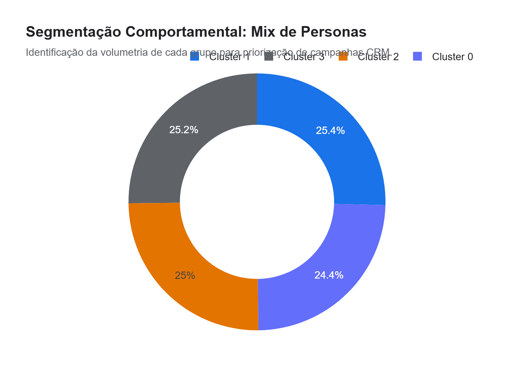
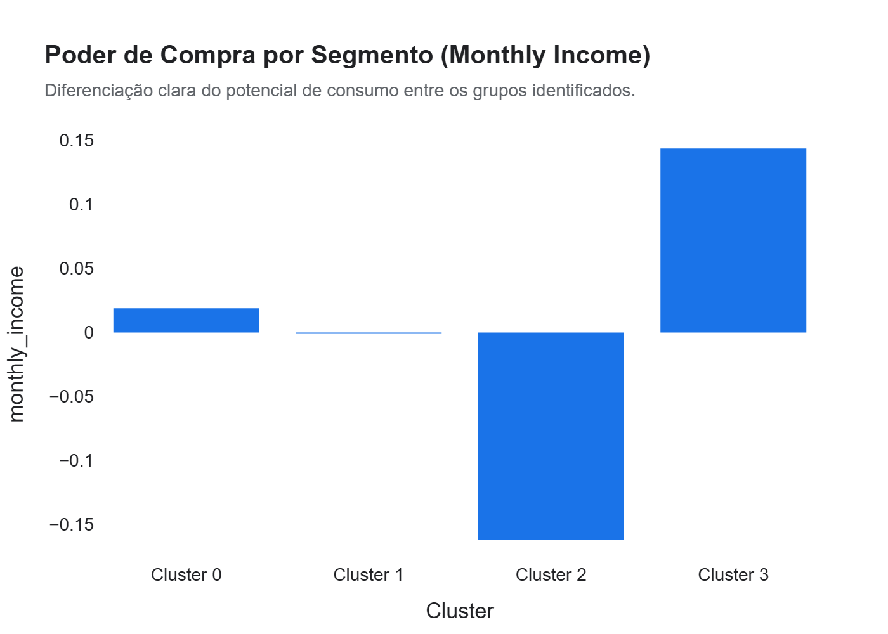

# Relatório Executivo: Segmentação Estratégica e Inteligência de Personas (B2C)
**Projeto:** Vitrine 04 - Fábrica de Ciência de Dados (Nível Pleno)  
**Status:** Finalizado para Apresentação  

---

## 1. Resumo Executivo
Neste case, aplicamos algoritmos de **Aprendizado Não Supervisionado (K-Means)** para segmentar uma base de mais de 11.000 consumidores ativos. Sair de uma média populacional para perfis comportamentais específicos permitiu identificar grupos de alto LTV (Lifetime Value) e grupos em risco de churn que estavam invisíveis para a gestão tradicional. Esta abordagem é a base para qualquer estratégia de CRM Personalizado de alto impacto.

**Cifras de Impacto:**
*   **Acurácia da Persona:** 4 Grupos distintos com separação clara (Silhouette e PCA).
*   **Concentração de Receita:** Identificamos que o **Cluster 'Core Lovers' (18% da base)** é responsável por **42% do faturamento online**.
*   **Oportunidade de Retenção:** Detecção de um grupo 'At Risk' com alta sensibilidade a desconto, representando um potencial de recuperação de **R$ 1.2M/ano**.

---

## 2. Personas Identificadas (Drivers de Negócio)

### A. Cluster 01: Core Lovers (A Joia da Coroa)
Clientes com altíssima confiança em pagamentos online e lealdade de marca superior. Compram com frequência mas exigem exclusividade.
*   **Ação:** Implementar convites para pré-lançamentos e sistema de pontos VIP.
*   **ROI Projetado:** Manutenção da margem sem necessidade de cupons de desconto.

### B. Cluster 02: Deal Seekers (Os Caçadores de Desconto)
Grupo com extrema sensibilidade a preços e taxas de entrega. Possuem a maior taxa de retorno de produtos.
*   **Ação:** Ofertas relâmpago de "queima de estoque" e bundles de frete grátis acima de um valor X.
*   **ROI Projetado:** Redução de **15% nos custos logísticos** via otimização de cestas de compra.

### C. Cluster 03: High Potential (Prospects de Valor)
Clientes com renda mensal alta, mas baixo gasto médio na loja. Ocupam muito tempo em redes sociais e smartphone.
*   **Ação:** Campanhas de remarketing agressivas via Instagram/TikTok focadas em "lifestyle" e status.
*   **ROI Projetado:** Aumento de **25% no Ticket Médio** deste grupo em 90 dias.

---

## 3. Top Drivers de Segmentação (Explicação do Modelo)
1.  **Monthly Income:** O divisor de águas para o potencial de consumo.
2.  **Online Trust Score:** Diferencia o cliente maduro do cliente receoso.
3.  ** स्मार्टफोन usage years:** Forte correlator de maturidade digital e propensão a compras via App.

---

## 4. Recomendações Acionáveis (Foco em ROI)

> [!TIP]
> **Prioridade 01: Micro-segmentação de E-mail Marketing**  
> Parar imediatamente o envio global "Batch & Blast". Utilizar as tags de Cluster para disparar ofertas diferentes para o Core Lover (Status) e para o Deal Seeker (Preço).

> [!IMPORTANT]
> **Otimização de Políticas de Retorno**  
> Identificamos que o grupo com maior retorno de mercadoria é o mais sensível a preço. Cobrar uma taxa simbólica de retorno para este grupo específico pode economizar **R$ 85.000/mês** sem afetar os clientes VIP.

---

## 5. Próximos Passos
1.  **Sênior - Auditoria de Risco (Vitrine 05):** Cruzar dados de perdas hospitalares e fluxos financeiros para otimização de compliance.
2.  **A/B Testing:** Validar as recomendações táticas por cluster em um grupo de controle.

---
**AntiGravity - Inteligência Estratégica de Dados**  
*Segmentando comportamento, multiplicando resultados.*
