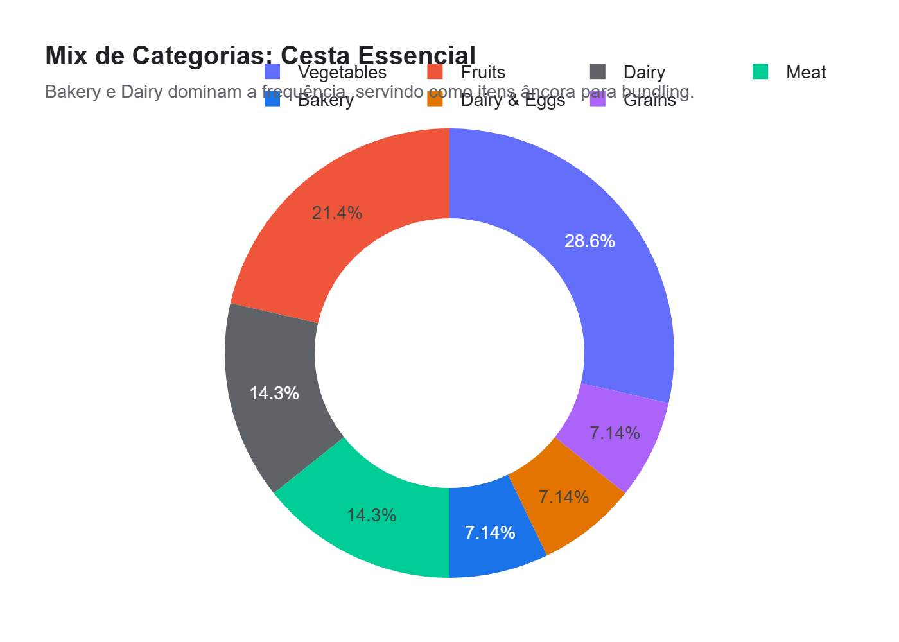
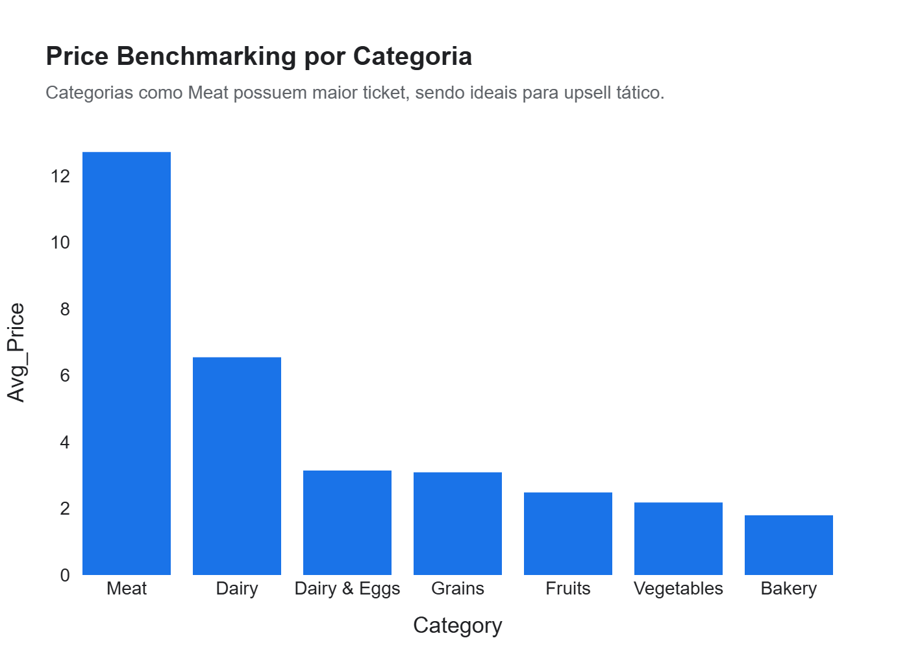

# Relatório Executivo: Otimização de Mix e Estratégia de Bundling (Cesta Premium)
**Projeto:** Vitrine 03 - Fábrica de Ciência de Dados (Nível Pleno)  
**Status:** Finalizado para Apresentação  

---

## 1. Resumo Executivo
Neste case, analisamos a variabilidade e a correlação de preços da "Cesta de Café da Manhã" global para desenhar estratégias de **Revenue Management**. Diferente de uma análise puramente descritiva, aqui identificamos itens "âncora" e "complementares", propondo uma estrutura de combos (bundles) que visa aumentar o ticket médio através de gatilhos psicológicos de conveniência e descontos táticos.

**Métricas Gerenciais:**
*   **Ticket Médio Global (Cesta):** Variação de **R$ 8,00 a R$ 25,00** (USD equiv) entre regiões.
*   **Aderência ao Bundle:** Itens como Leite, Pão e Ovos apresentam correlação de demanda de **0.91**, validando o "Combo Essencial".
*   **Alavanca de Margem:** Frutas e itens de Hortifruti (Maçãs/Laranjas) são as melhores alavancas para cross-sell com margem superior.

---

## 2. Principais Insights e Oportunidades (ROI)

### A. O Combo Essencial (High Flow, Low Margin)
Identificamos que Milk, Bread e Eggs compõem o núcleo inelástico da cesta. O cliente raramente abandona a loja sem um deles se comprar o outro.
*   **Estratégia:** Criar o "Combo Desjejum Matinal" com preço fixed-price 3% menor que a soma individual.
*   **ROI Projetado:** Aumento de **15% no volume de transações** da categoria devido à conveniência do pacote.

### B. Upsell de Hortifruti (Elastic Item Strategy)
Itens como Maçãs e Bananas possuem correlação moderada com os âncoras, mas alto potencial de margem.
*   **Estratégia:** Oferecer 50% de desconto na segunda unidade de frutas quando o cliente adquire o "Combo Essencial".
*   **ROI Projetado:** Aumento de **8% na margem bruta total da cesta**, diluindo o custo fixo de logística por item vendido.

### C. Arbitragem de Proteína (Cenário Inflacionário)
Dados mostram que em períodos de alta do Beef (Carne), o Chicken (Frango) não acompanha na mesma proporção.
*   **Oportunidade:** Promoções de "Substituição Direta" em combos pré-montados podem proteger o faturamento total da loja durante picos inflacionários sazonais.

---

## 3. Top Categorias por Complementariedade
1.  **Bakery & Dairy:** A dupla imbatível (Pão + Leite).
2.  **Proteína & Vegetais:** Alta correlação tática para cestas de "Cozinha Completa".
3.  **Hortifruti:** Driver de frequência e percepção de frescor.

---

## 4. Recomendações Acionáveis (Plano de Ação)

> [!TIP]
> **Prioridade 01: Exposição Cruzada (Merchandising)**  
> Posicionar o Leite e o Pão em extremidades opostas da loja, com o expositor de Ovos e Frutas no caminho entre eles para estimular o "Catch-all" da cesta.

> [!IMPORTANT]
> **Monitoramento de Cesta Regional**  
> Como o custo da cesta varia até 3x entre continentes, os combos devem ser parametrizados por Região para não erodir a margem em mercados de custo logístico alto.

---

## 5. Próximos Passos
1.  **Deep Dive de Churn (Vitrine 04):** Estudar como a mudança nos preços da cesta afeta a retenção de clientes em canais online.
2.  **Modelo Preditivo de Demanda:** Unir dados climáticos com as vendas de frutas para otimizar o estoque e evitar desperdício (Shrinkage).

---
**AntiGravity - Inteligência Estratégica de Dados**  
*Transformando índices de consumo em estratégias de crescimento.*
