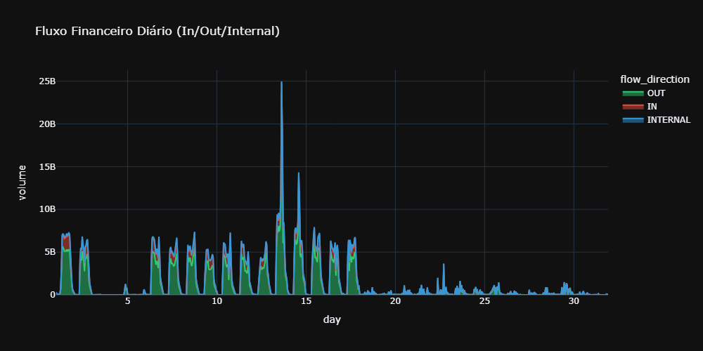
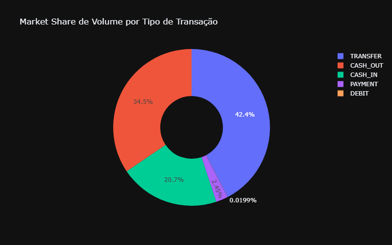
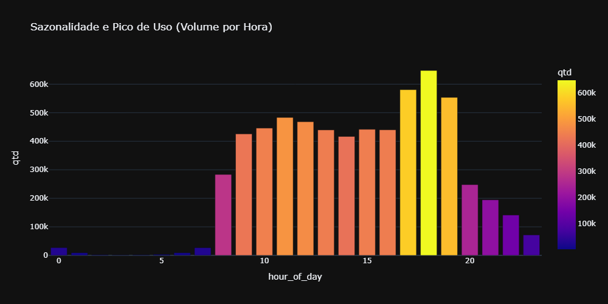
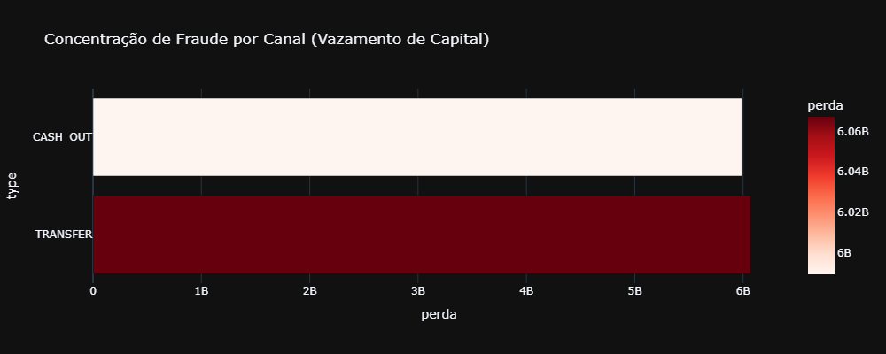

# Projeto Senior 08 - Análise de Fraude Financeira (BigQuery)

## 📌 Visão Geral
Este projeto simula um ambiente de Data Warehouse de alta performance para detecção de anomalias e análise de fluxo financeiro em larga escala. Utilizando a base de dados **PaySim**, foram processadas mais de **6.3 milhões de transações** para identificar o impacto financeiro de fraudes e mapear o comportamento de consumo (sazonalidade e volume).

## 📊 Dashboards de Inteligência (Outputs do BigQuery)

### 1. Fluxo Financeiro e Market Share
A operação é massiva, mas altamente concentrada. Identificamos que as operações de Saída (`TRANSFER` e `CASH_OUT`) dominam o volume financeiro do ecossistema.

### 2. Sazonalidade de Uso (Teste de Stress)
O sistema apresenta um pico de uso severo às **18:00h**, com centenas de milhares de transações em uma única hora. Essa métrica é vital para arquitetura de Cloud Auto-scaling.

### 3. Diagnóstico Forensic (Prevenção de Fraude)
A fraude custou virtualmente **R$ 12 bilhões** e está 100% alocada nos canais de saída. A recomendação tática é a implementação imediata de 2FA (Aprovação em Duas Etapas) para grandes transferências.

## 🛠️ Stack Tecnológico
*   **Engine Analítica:** Google BigQuery (GoogleSQL)
*   **Ingestão de Dados:** Google Cloud Storage (Bucket via wildcard upload)
*   **Visualização:** Python (Plotly) via Jupyter Notebooks
*   **Narrativa de Negócios:** Markdown (Relatórios Executivos)

## 📂 Estrutura do Projeto
*   `/notebooks/BigQuery_SQL_Analysis.ipynb`: Código-fonte para conexão com API do GCP e geração de dashboards interativos.
*   `/reports/Executive_Financial_Analysis_PaySim.md`: Relatório executivo detalhando o ROI de mitigação e principais ofensores.
*   `/src/BigQuery_Analysis.sql`: Script SQL bruto para deploy e criação de Views no console do BigQuery.
*   `/reports/images/`: Exports visuais das análises para documentação.

---
*Projeto desenvolvido como showcase de proficiência em arquitetura Cloud e Analytics Sênior.*
