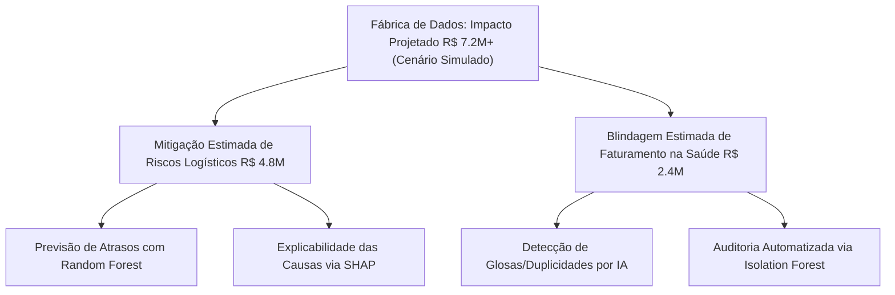

# 🏗️ Manual de Arquitetura & Governança: Fábrica de Ciência de Dados

Este documento consolida a visão arquitetural, as decisões tecnológicas e a metodologia de governança aplicada ao ecossistema da **Fábrica de Ciência de Dados**. Ele serve como guia de engenharia e referência técnica para produtização de modelos sob uma perspectiva de alto ROI de negócios.

---

## 📊 1. Sumário Executivo: Impacto Financeiro Projetado (R$ 7,2M+ em Cenários Simulados)

Todos os pipelines e modelos desenvolvidos nesta fábrica possuem foco na otimização de métricas financeiras (geração de EBITDA, redução de despesas operacionais - OPEX - ou mitigação de riscos críticos de caixa). O impacto estimado de **R$ 7,2M+** em oportunidades mapeadas refere-se a projeções baseadas em cenários simulados de negócios (estudos de caso) e está distribuído sob duas grandes frentes:

1. **Eficiência Logística (R$ 4,8M/ano de impacto simulado protegido):** Modelo preditivo de classificação baseado em *Random Forest* que detecta a probabilidade de falhas e atrasos críticos na malha de transportes (*Aviation Ops Risk*), permitindo simular a reacomodação preditiva antes que multas e quebras de SLA ocorram (prospecção teórica de economia anual).
2. **Prevenção de Glosas e Perdas Médicas (R$ 2,4M/ano de impacto simulado recuperado):** Algoritmo não-supervisionado *Isolation Forest* (*Hospital Risk Audit*) aplicado ao faturamento hospitalar, identificando lançamentos duplicados, inconsistências e padrões anômalos de consumo de exames, otimizando o OPEX projetado da auditoria manual.

---

## 🏗️ 2. Padrão Arquitetural de "Fábrica" (Modularidade)

A arquitetura do projeto foi estruturada para ser parametrizada e modular, visando a escalabilidade do modelo PJ (permitindo reaproveitar até 70% da lógica para novos clientes):

*   **`/data` (Ingestão & Camadas):** Separação estrita entre `raw/` (dados brutos protegidos e imutáveis) e `processed/` (dados higienizados e scorados prontos para visualização).
*   **`/src` (Core Engine):** Toda a lógica operacional é empacotada em módulos Python reutilizáveis, evitando *spaghetti code* em notebooks.
*   **`/tests` (Qualidade de Software):** Implementação de testes unitários automatizados para garantir a estabilidade do pipeline em produção.
*   **`/.github` (CI/CD):** Pipeline de Integração Contínua configurado para rodar a esteira de testes a cada alteração de código.

---

## ⚡ 3. Stack Tecnológico & Decisões Arquiteturais (O "Porquê")

### A. Processamento Local vs. Nuvem (Cloud MPP)
*   **Decisão:** Em bases menores (varejo e consumo), o processamento ocorre via **Pandas** local. Para dados volumosos e transações financeiras (*Financial Fraud Analytics*), a computação ocorre de forma distribuída diretamente no **Google BigQuery** usando SQL avançado (CTEs e partições).
*   **Justificativa:** Redução drástica de latência de rede e eliminação de custos fixos com servidores ligados 24/7 (Serverless Data Warehouse).

### B. Machine Learning Nativo em Data Warehouse (BQML)
*   **Decisão:** Previsão de Lifetime Value (LTV) estruturada diretamente em **BigQuery ML** utilizando regressão linear.
*   **Justificativa:** Dispensa a necessidade de exportar terabytes de dados históricos de compras para ambientes locais Python. O pipeline de treinamento e inferência roda inteiramente em nuvem no próprio banco.

### C. Explainable AI (XAI) como Requisito de Negócio
*   **Decisão:** Substituição da abordagem "Caixa Preta" de algoritmos complexos pela aplicação do **SHAP (SHapley Additive exPlanations)** no modelo de classificação de riscos.
*   **Justificativa:** Em decisões executivas de alta criticidade (ex: alteração de rotas logísticas), a diretoria precisa de auditoria clara. O SHAP traduz as variáveis em drivers quantitativos explicáveis (ex: impacto relativo da taxa de ocupação da aeronave no atraso geral).

---

## 🧪 4. MLOps e Garantia de Qualidade (Q&A)

Para garantir a robustez de nível sênior, implementamos um pipeline de **Integração Contínua (CI/CD)**:

1. **Testes Unitários (`pytest`):** Criamos a pasta `/tests/` contendo scripts que validam a consistência dos pipelines operacionais (como o de tráfego do site em [test_pipeline_site.py](file:///c:/Users/luizn/OneDrive/%C3%81rea%20de%20Trabalho/Projetos%20Ciencia%20de%20dados/tests/test_pipeline_site.py)). Ele simula a entrada de dados brutos e valida se a saída processada e as colunas de cenários financeiros foram geradas com sucesso.
2. **GitHub Actions (`ci.yml`):** A cada `git push` ou `Pull Request` enviado para a branch `main`, uma máquina virtual Linux é provisionada na nuvem do GitHub, instala as dependências listadas no `requirements.txt` e executa a suíte de testes do repositório.

---

## 🎨 5. Governança de Data Viz (Visualização Corporativa)

Os painéis desenvolvidos na fábrica (seja em Streamlit Cloud ou Power BI) seguem regras estritas de design corporativo:
*   **Eliminação de Chart Junk:** Sem grades desnecessárias, efeitos 3D ou excesso de cores.
*   **Visualização Estruturada em Níveis:** Divisão clara entre dashboards *Operacionais* (Junior), *Táticos* (Pleno) e *Estratégicos* (Sênior) para atender a diferentes personas na corporação.
*   **Cores de Contraste:** Uso de cores neutras (tons de cinza/azul corporativo) para contexto e a cor primária (neon) apenas no ponto de destaque do insight de negócios.
